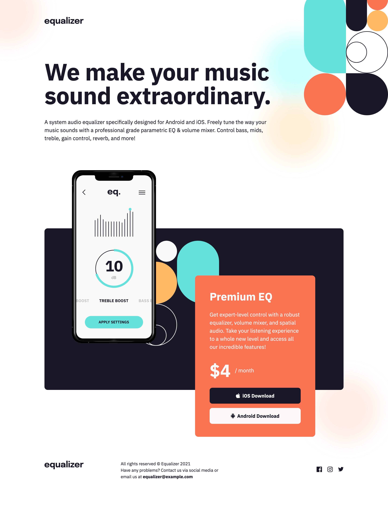
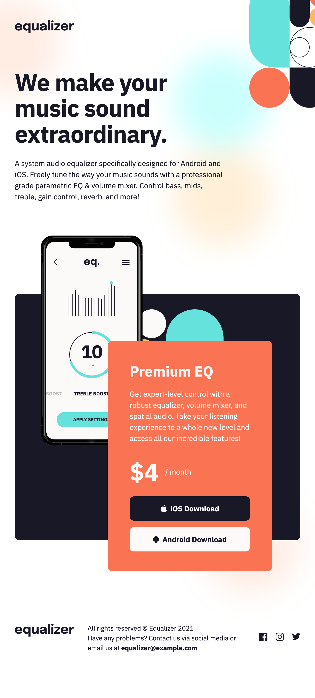
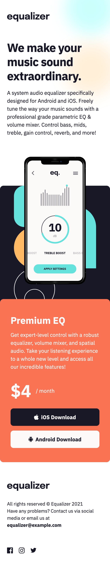

# Frontend Mentor - Equalizer landing page solution

This is a solution to the [Equalizer landing page challenge on Frontend Mentor](https://www.frontendmentor.io/challenges/equalizer-landing-page-7VJ4gp3DE). Frontend Mentor challenges help you improve your coding skills by building realistic projects.

## Table of contents

- [Overview](#overview)
  - [The challenge](#the-challenge)
  - [Self assigned challenges](#self-assigned-challenges)
  - [Screenshots](#screenshots)
  - [Links](#links)
- [My process](#my-process)
  - [Built with](#built-with)
  - [What I learned](#what-i-learned)
  - [Continued development](#continued-development)
  - [Useful resources](#useful-resources)
- [Author](#author)
- [Acknowledgements](#acknowledgements)

## Overview

### The challenge

Users should be able to:

- View the optimal layout depending on their device's screen size

### Self assigned challenges

- Try as much as possible to minimise sharp changes to layout via media queries... which means a lot of linear interpolation via `clamp` between various font-sizes, padding/margin lengths etc 🤮

### Screenshots

### Links

- [Solution URL](https://www.frontendmentor.io/solutions/equalizer-landing-page-responsive-size-changes-GXv6KXlSUI)
- [Live Site URL](https://sh-equalizer.netlify.app/)

## My process

### Built with

- Semantic HTML5 markup
- CSS custom properties
- Flexbox

### What I learned

- It is very difficult to take layouts that don't follow a coherent design system and force them into one. At first, I attempted to use concepts from Every Layout to build this design, but it became clear that this was a herculean task given that the design wasn't built with these kinds of components in mind.
- Building sites via explicit media queries to change layout is much less time consuming than building something truly responsive. Admittedly, I wouldn't have had to build _so many_ clamp declarations in my CSS if the design had consistent padding/heading size changes. On the subject of clamp...
- I had to dust off my maths to figure out how to use linear interpolation to dynamically change, for example, the size of `h1` tag between desktop and mobile sizes. Whilst I'm confident there's a way to implement this without resorting to magic numbers for the clamp declarations which litter my CSS doc, my attempts ended in failure and as such I used a website (linked in [Useful resources](#useful-resources)) to generate these for me.
- Sometimes, you've got to throw away the resources provided by Frontend Mentor and rebuild it yourself to make something work. In this example, the background image was provided as one large image for each viewport size (so one image for desktop, one for tablet, one for mobile). This was very unwieldy to make work as the background image elements required specific sizing and positioning at each provided viewport. Therefore, I ended up exporting each background image element individually from Figma and then implemented each `png` separately rather than all in one go.
- That a seemingly difficult Flexbox implementation is actually really simple if you just nest Flexbox items. I spent so long trying to get the footer element to work as one Flexbox item, before realising I could just implement it as 2 nested Flexbox elements and solved it in about 5 minutes...
- That, as much as I had best intentions around trying to achieve this design without media queries, there are certain things that simply require it, and that's okay 😀
- How to use inline svgs so that I can change their values using CSS (an example of this is the hover effect on the social icons in the footer), as well as generally how to edit them to make them accessible so they scale with user zoom on the browser.
- That you can't nest a `button` tag inside of an `a` tag. Instead, just style the `a` tag!

### Continued development

- Try to implement linear interpolation via CSS variables rather than magic numbers in future designs.

### Useful resources

- [Fluid Typography Tool](https://fluidtypography.com/#app-get-started) - literally every clamp that you see in my `global.css` was created using this tool to calculate linear interpolation between 2 points.
- [Every Layout](https://every-layout.dev/) - incredibly insightful resource that helped me develop my understanding of how to achieve certain kinds of layouts more easily.
- [Editing SVGs](https://www.w3schools.com/html/html5_svg.asp)

## Author

- Website - [Sam Hemingway](https://samhemingway.dev)
- Frontend Mentor - [@SamHemingway](https://www.frontendmentor.io/profile/samhemingway)

## Acknowledgements

- Thanks to [@faruking](https://www.frontendmentor.io/profile/faruking) on FEM who got me thinking about different ways to approach the footer! Whilst I didn't go with their solution, it was their idea that made me realise that I could just nest Flexboxes to implement with a defined `flex-basis` for each element to achieve the design in a graceful way.
